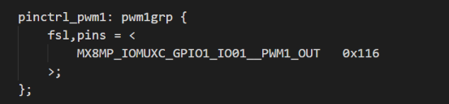
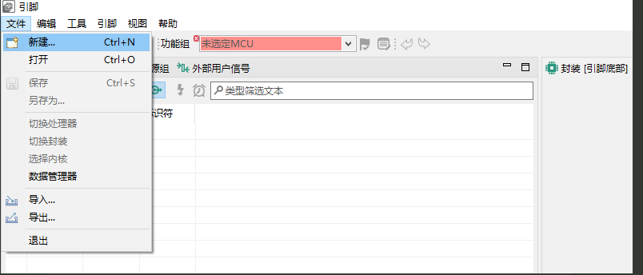
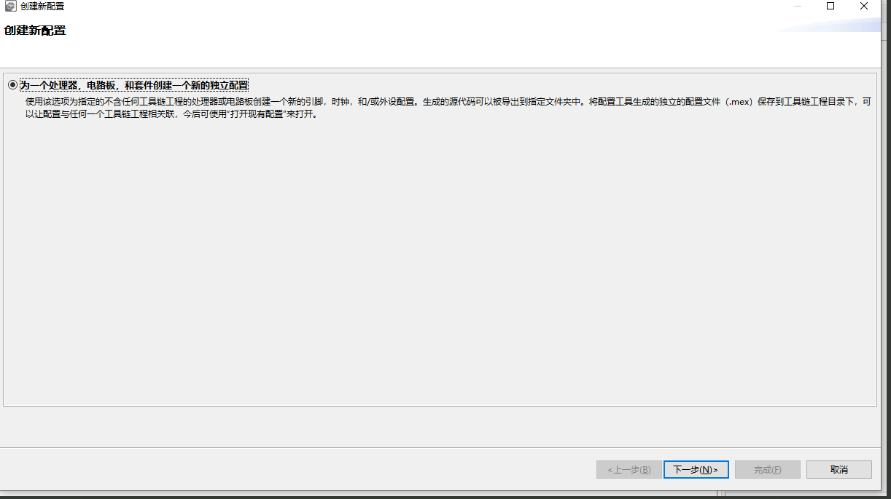
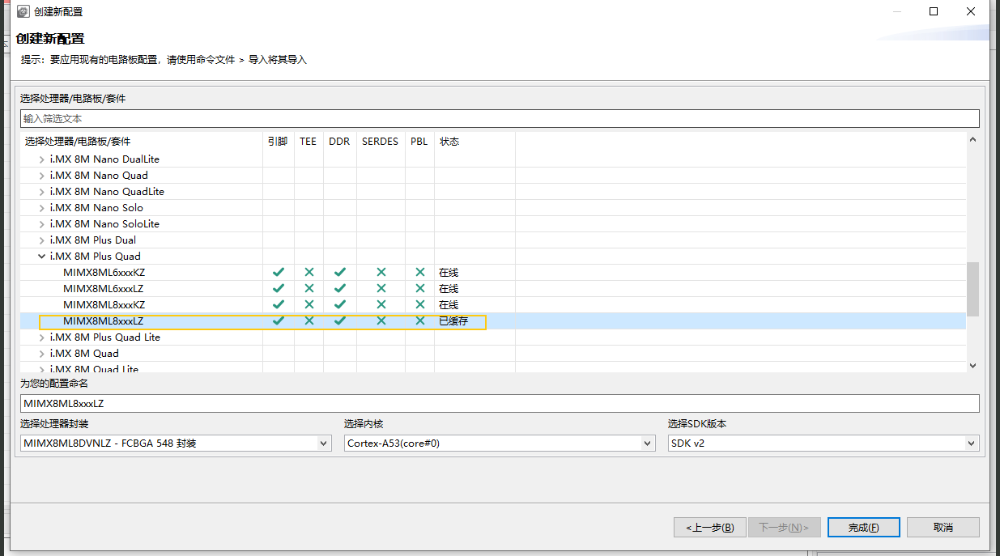
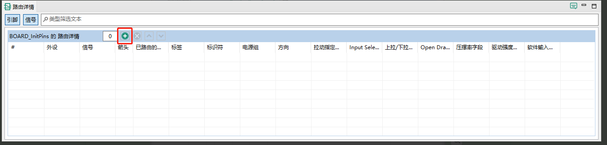
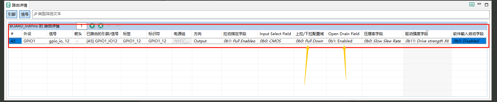
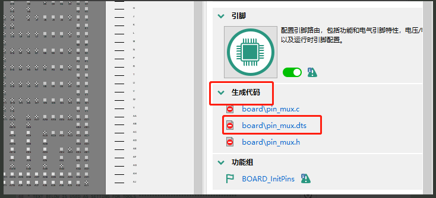
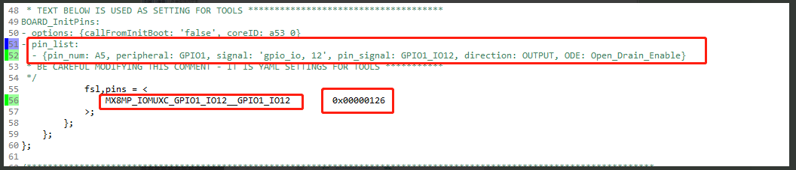

# ⚡ Device Tree Pin Electrical Property Configuration  

Below explains how to modify pin electrical property parameters:  

📌 1. **Pin Description in Device Tree**  
In Linux, **pin configuration is typically defined in the Device Tree**. This informs the kernel about:  
- Each pin's function (GPIO, I2C, UART, SPI, etc.)  
- Specific electrical characteristics (pull-up/pull-down, drive strength, etc.)  

Example:  
```dts
MX8MP_IOMUXC_GPIO1_IO01__PWM1_OUT   // Pin multiplexing (pin name + function)  
0x116                                 // Configuration parameters (drive strength, pull-up/down, OD, etc.)  
```  
  

> DEBIX pin multiplexing macros can be found in:  
> `arch/arm64/boot/dts/freescale/imx8mp-pinfunc.h`

---

🛠 2. **Configuring Pin Properties Using NXP Official Tools**  
Steps to set DEBIX pin electrical properties:  

* a. **Launch Config Tools for i.MX v13**  
  File → New  
  Download: [Config Tools for i.MX](https://www.nxp.com/design/design-center/development-boards-and-designs/i-mx-evaluation-and-development-boards/config-tools-for-i-mx-applications-processors:CONFIG-TOOLS-IMX)  
    

* b. **Create New Configuration** → Next  
    

* c. **Select DEBIX Processor** → Finish  
    

* d. **Configure Electrical Properties** (Example: GPIO1_IO12)  
    
    

  Key configurations:  
  - **🧲 Pull-up / Pull-down**  
  - **🔌 Open Drain**  

* e. **Generate Code**  
  Click "Generate Code" on the right  
    

  Pin multiplexing and electrical properties description:  
  