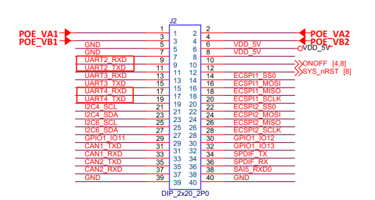
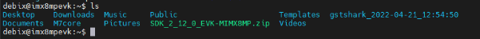
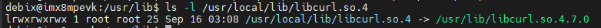
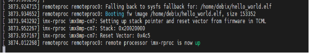

# 🚀 Guide: Booting M7 Core Alongside Linux Core on DEBIX U-Boot

## 🧩 Part 1: Obtaining M7 Firmware

📥 Acquisition Methods:  
1. 🛠️ Compile using **IAR project**  
2. 🧪 Compile using **ARMCC toolchain**  

Reference (NXP Official Guide):  
1. Get official SDK: https://mcuxpresso.nxp.com/en/select  
   (Download package: EVK-MIMX8MP-hello_world.zip)

## 🧠 Part 2: Booting M7 Core from U-Boot

📝 1. Modify Device Tree `/arch/arm64/boot/dts/freescale/imx8mp-evk.dts`  
Add to root node:
```c
reserved-memory {
    #address-cells = <2>;
    #size-cells = <2>;
    ranges;

    m4_reserved: m4@0x80000000 {
        no-map;
        reg = <0 0x80000000 0 0x1000000>;
    };
    vdev0vring0: vdev0vring0@55000000 {
        reg = <0 0x55000000 0 0x8000>;
        no-map;
    };
    vdev0vring1: vdev0vring1@55008000 {
        reg = <0 0x55008000 0 0x8000>;
        no-map;
    };
    vdevbuffer: vdevbuffer@55400000 {
        compatible = "shared-dma-pool";
        reg = <0 0x55400000 0 0x100000>;
        no-map;
    };
    rsc_table: rsc_table@550ff000 {
        reg = <0 0x550ff000 0 0x1000>;
        no-map;
    };
};
imx8mp-cm7 {
    compatible = "fsl,imx8mp-cm7";
    rsc-da = <0x55000000>;
    clocks = <&clk IMX8MP_CLK_M7_DIV>;
    mbox-names = "tx", "rx", "rxdb";
    mboxes = <&mu 0 1
          &mu 1 1
          &mu 3 1>;
    memory-region = <&vdevbuffer>, <&vdev0vring0>, <&vdev0vring1>, <&rsc_table>;
    status = "okay";
};
```

⏰ 2. Modify Device Clock `clk-imx8mp.c`
```c
--- /drivers/clk/imx/clk-imx8mp.c
+++ /drivers/clk/imx/clk-imx8mp.c
@@ -728,6 +728,9 @@
 
     check_m4_enabled();
 
+    if (of_find_compatible_node(NULL, NULL, "fsl,imx8mp-cm7"))
+        set_cm4_enable(true);
+
     np = of_find_compatible_node(NULL, NULL, "fsl,imx8mp-anatop");
     anatop_base = of_iomap(np, 0);
     of_node_put(np);
```

⚙️ 3. Modify M7 Core Device Driver
```c
--- /drivers/remoteproc/imx_rproc.c
+++ /drivers/remoteproc/imx_rproc.c
@@ -25,6 +25,11 @@
 
 #include "remoteproc_internal.h"
 
+// added by wei
+#define TCML_ADDR_IMX8M        0x7e0000
+#define TCML_ADDR_IMX8_CM4_1        0x34fe0000
+#define TCML_ADDR_IMX8_CM4_2        0x38fe0000
+
 #define IMX7D_SRC_SCR            0x0C
 #define IMX7D_ENABLE_M4        BIT(3)
 #define IMX7D_SW_M4P_RST        BIT(2)
@@ -131,10 +136,37 @@
     int                num_domains;
     struct device            **pm_devices;
     struct device_link        **pm_devices_link;
+    // added by wei
+    u32                m_core_ddr_addr;
+    u32                 last_load_addr;
+    u32                m4_start_addr;
 };
 
 static struct imx_sc_ipc *ipc_handle;
 
+// added by wei
+static const struct imx_rproc_att imx_rproc_att_imx8mp[] = {
+    /* dev addr , sys addr  , size        , flags */
+    /* ITCM   */
+    {0x00000000, 0x007E0000, 0x00020000, ATT_OWN},
+    /* OCRAM_S */
+    {0x00180000, 0x00180000, 0x00009000, 0},
+    /* OCRAM */
+    {0x00900000, 0x00900000, 0x00090000, 0},
+    /* QSPI Code - alias */
+    {0x08000000, 0x08000000, 0x08000000, 0},
+    /* DDR (Code) - alias */
+    {0x10000000, 0x40000000, 0x0FFE0000, 0},
+    /* DTCM */
+    {0x20000000, 0x00800000, 0x00020000, ATT_OWN},
+    /* OCRAM_S - alias */
+    {0x20180000, 0x00180000, 0x00008000, ATT_OWN},
+    /* OCRAM */
+    {0x20200000, 0x00900000, 0x00090000, ATT_OWN};
```

```c
--- /drivers/remoteproc/remoteproc_core.c
+++ /drivers/remoteproc/remoteproc_core.c
@@ -1114,6 +1114,14 @@
     if (!rproc->table_ptr)
         return 0;
 
+    // added by wei
+
+    if ((int)rproc->table_ptr->num < 0) {
+        WARN_ON(rproc->table_ptr->num);
+        rproc->table_ptr->num=0;
+        return 0;
+    }
+
     for (i = 0; i < rproc->table_ptr->num; i++) {
         int offset = rproc->table_ptr->offset[i];
         struct fw_rsc_hdr *hdr = (void *)rproc->table_ptr + offset;
@@ -1373,7 +1381,7 @@
      * that any subsequent changes will be applied to the loaded version.
      */
     loaded_table = rproc_find_loaded_rsc_table(rproc, fw);
-    if (loaded_table) {
+    if (loaded_table && rproc->cached_table) {
         memcpy(loaded_table, rproc->cached_table, rproc->table_sz);
         rproc->table_ptr = loaded_table;
     }
```

```c
--- /drivers/remoteproc/remoteproc_elf_loader.c
+++ /drivers/remoteproc/remoteproc_elf_loader.c
@@ -133,16 +133,16 @@
 {
     if (!rproc->ops->elf_memcpy)
         memcpy(dest, src, count);
-
-    rproc->ops->elf_memcpy(rproc, dest, src, count);
+    else
+        rproc->ops->elf_memcpy(rproc, dest, src, count);
 }
 
 static void rproc_elf_memset(struct rproc *rproc, void *s, int c, size_t count)
 {
     if (!rproc->ops->elf_memset)
         memset(s, c, count);
-
-    rproc->ops->elf_memset(rproc, s, c, count);
+    else
+        rproc->ops->elf_memset(rproc, s, c, count);
 }
```

4. **File Copy**  
Copy `hello_world.bin` to SD card (same partition as kernel and device tree)

5. **Hardware Connection**  
Connect UART2 and UART4 to PC (baud rate: 115200):  


6. **Boot M7 Core**  
In the U-Boot command line, run the following command:
```shell
fatload mmc 1:1 0x48000000 hello_world.bin;cp.b 0x48000000 0x7e0000 20000;  
bootaux 0x7e0000  
```
- UART4 should output "hello world" indicating M7 core is working
- Execute `bootcmd` to boot Linux - both A53 and M7 cores should work concurrently

7. **U-Boot Quick Boot Setup**  
In the U-Boot command line, run the following command:
```shell
setenv m7_image hello_world.bin
setenv m7_loadaddr 0x7e0000
setenv m7_copyaddr 0x96000000
setenv m7_loadimage "fatload mmc '${mmcdev}':'${mmcpart}' '${m7_copyaddr}' '${m7_image}'; cp.b '${m7_copyaddr}' '${m7_loadaddr}' 0x20000"
setenv run_m7_image "run m7_loadimage; dcache flush; bootaux '${m7_loadaddr}'" 
```
Execute `run run_m7_image` to directly boot M7 core from U-Boot

## 🧑‍💻 Part 3: Developing M7 Firmware on DEBIX

1. **Get SDK Source**  
https://mcuxpresso.nxp.com/en/download?hash=502a027cddc304d8e16cc44319a90811&uvid=455793&dl=1&js=1&to_vault=true

2. **Copy SDK Package to DEBIX**  


3. **Create a Folder and Extract the SDK to it**  
```shell
mkdir M7_SDK
unzip SDK_2_12_0_EVK-MIMX8MP.zip -d M7_SDK
```

4. **Install CMake**  

① Install CMake:
```shell
sudo apt install cmake 
```
② Create a symbolic link to the dynamic library:   
(*Otherwise CMake compilation will fail with "libcurl.so.4 not found"*)
```
sudo rm /usr/lib/libcurl.so.4
sudo ln -s /usr/lib/libcurl.so.4.7.0 /usr/local/lib/libcurl.so.4
```
Verify:
```shell
ls -l /usr/local/lib/libcurl.so.4
```


5. **Get gcc-arm-none-eabi Toolchain**  

Enter the M7_SDK/ directory, obtain the toolchain and configure the environment variables:
```shell
cd M7_SDK/
wget https://armkeil.blob.core.windows.net/developer/Files/downloads/gnu-rm/9-2019q4/gcc-arm-none-eabi-9-2019-q4-major-aarch64-linux.tar.bz2
tar -xvf gcc-arm-none-eabi-9-2019-q4-major-aarch64-linux.tar.bz2
```
Edit `.bashrc`, configure the environment variable and add the following content on the last line::
```shell
sudo vi ~/.bashrc
export ARMGCC_DIR=~/M7_SDK/gcc-arm-none-eabi-9-2019-q4-major
source ~/.bashrc
```

6. **Compile Firmware**  

Navigate to the armgcc directory of the hello_world project:
```shell
cd ~/M7_SDK/boards/evkmimx8mp/demo_apps/hello_world/armgcc/
```
Run the build_all.sh script, which will generate these folders in the current directory. Typically, the release version is used:
```
./build_all.sh  # Generates release version
```

7. **Use Firmware**  

Create a root directory under the M7_SDK directory, mount Partition 1 of the SD card to this directory, then copy the hello_world.bin file compiled in the previous step into this directory:
```shell
cd ~/M7_SDK
mkdir root && cd root
sudo cp -f ../boards/evkmimx8mp/demo_apps/hello_world/armgcc/release/hello_world.bin ./
```
After reboot, execute `run run_m7_image` in U-Boot to load new firmware

## 🔧 Part 4: Flashing and Booting M7 Firmware

1. **Prepare Firmware**  
Use `hello_world.elf` from release folder

2. **Check M7 Core Status**  

Switch to the root user, modify the kernel log print level:
```shell
sysctl kernel.printk=7
```
Check M7 core status:
```
cat /sys/class/remoteproc/remoteproc0/state
```
If the M7 core was started in U-Boot, you must first stop it:
```shell
echo stop > /sys/class/remoteproc/remoteproc0/state
```

3. **Flash Firmware**  
```shell
echo /home/debix/M7_SDK/boards/evkmimx8mp/demo_apps/hello_world/armgcc/release/hello_world.elf > /sys/class/remoteproc/remoteproc0/firmware
```

4. **Boot M7 Core**  
```shell
echo start > /sys/class/remoteproc/remoteproc0/state
```
📟 UART4 output confirms successful boot:  
