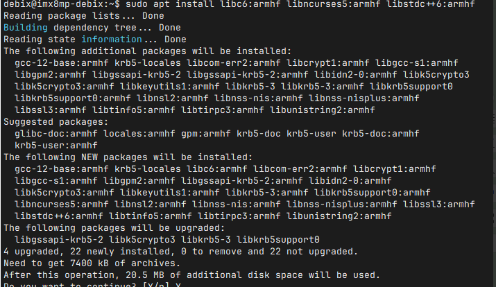

### Enabling 32-bit Support and Running 32-bit Programs on DEBIX Model A (Ubuntu 22.04 64-bit)  

The DEBIX Model A runs **64-bit Ubuntu** by default. To execute **32-bit programs** built for the `armhf` architecture, follow these configuration steps.  

🧱 **Step 1: Add 32-bit (armhf) architecture support**  
```shell  
sudo dpkg --add-architecture armhf  
```  
🧠 *Explanation*:  
- `armhf` denotes the ARM hard-float 32-bit architecture.  
- This command enables apt to install 32-bit packages.  

🔄 **Step 2: Update package index**  
```shell  
sudo apt update  
```  

📦 **Step 3: Install essential 32-bit runtime libraries**  
```shell  
sudo apt install libc6:armhf libncurses5:armhf libstdc++6:armhf  
```  
📌 *These are fundamental dependencies for most 32-bit programs*:  

| Package               | Function                          |  
|-----------------------|-----------------------------------|  
| `libc6:armhf`         | Standard C runtime (glibc)        |  
| `libncurses5:armhf`   | Terminal UI support               |  
| `libstdc++6:armhf`    | C++ runtime library               |  

  

🧰 **Step 4: Install 32-bit applications**  
To install a 32-bit version of an apt-available program (e.g., `nano`):  
```shell  
sudo apt install nano:armhf  
```  

✅ **Step 5: Verify with a 32-bit application**  
🧾 Prepare a program compiled with a 32-bit `armhf` compiler (e.g., using `arm-linux-gnueabihf-gcc`).  
📁 Copy it to DEBIX, set permissions, and execute:  
```shell  
chmod +x my_32bit_app  
./my_32bit_app  
```  
✅ Successful execution confirms correct 32-bit runtime configuration.  

🔍 **ELF architecture verification**:  
Confirm a program is 32-bit with:  
```shell  
file my_32bit_app  
```  
Sample output:  
```shell  
my_32bit_app: ELF 32-bit LSB executable, ARM, EABI5, version 1 (SYSV), ...  
```