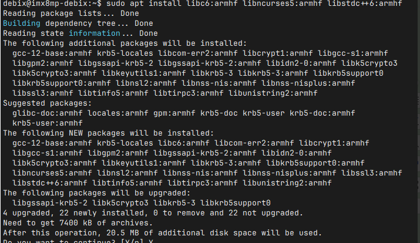

🧬 在 DEBIX Model A 上启用 32 位支持并运行 32 位程序（Ubuntu 22.04 64-bit）

DEBIX Model A 默认运行的是 **64 位 Ubuntu**，若你想运行 `armhf` 架构的 **32 位程序**，可按以下步骤进行设置。


🧱 步骤 1：添加 32 位（armhf）架构支持

```shell
sudo dpkg --add-architecture armhf
```

🧠 解释：

- `armhf` 是 ARM 硬浮点 32 位架构；
- 这个命令让 apt 支持安装 32 位版本的软件包。

🔄 步骤 2：更新软件包索引

```shell
sudo apt update
```

📦 步骤 3：安装常用 32 位运行时依赖库

```shell
sudo apt install libc6:armhf libncurses5:armhf libstdc++6:armhf
```

📌 这些是大多数 32 位程序所需的基本运行库：

| 包名                | 作用                     |
| ------------------- | ------------------------ |
| `libc6:armhf`       | 标准 C 运行时库（glibc） |
| `libncurses5:armhf` | 控制台 UI 支持           |
| `libstdc++6:armhf`  | C++ 程序运行库           |




🧰 步骤 4：安装 32 位版本的应用程序

如果你希望安装某个已在 apt 仓库中的程序（如 `nano`）的 32 位版本，用以下格式：

```shell
sudo apt install nano:armhf
```

✅ 步骤 5：运行 32 位应用进行验证

🧾 准备一个已用 32 位 `armhf` 编译器（如 `arm-linux-gnueabihf-gcc`）编译好的程序；

📁 将其拷贝到 DEBIX；

设置可执行权限并运行：

```shell
chmod +x my_32bit_app
./my_32bit_app
```

✅ 若程序成功运行，说明 32 位运行时环境已配置正确。

🔍 如何检查 ELF 架构：

运行以下命令确认程序是 32 位：

```shell
file my_32bit_app
```

输出示例：

```shell
my_32bit_app: ELF 32-bit LSB executable, ARM, EABI5, version 1 (SYSV), ...
```

