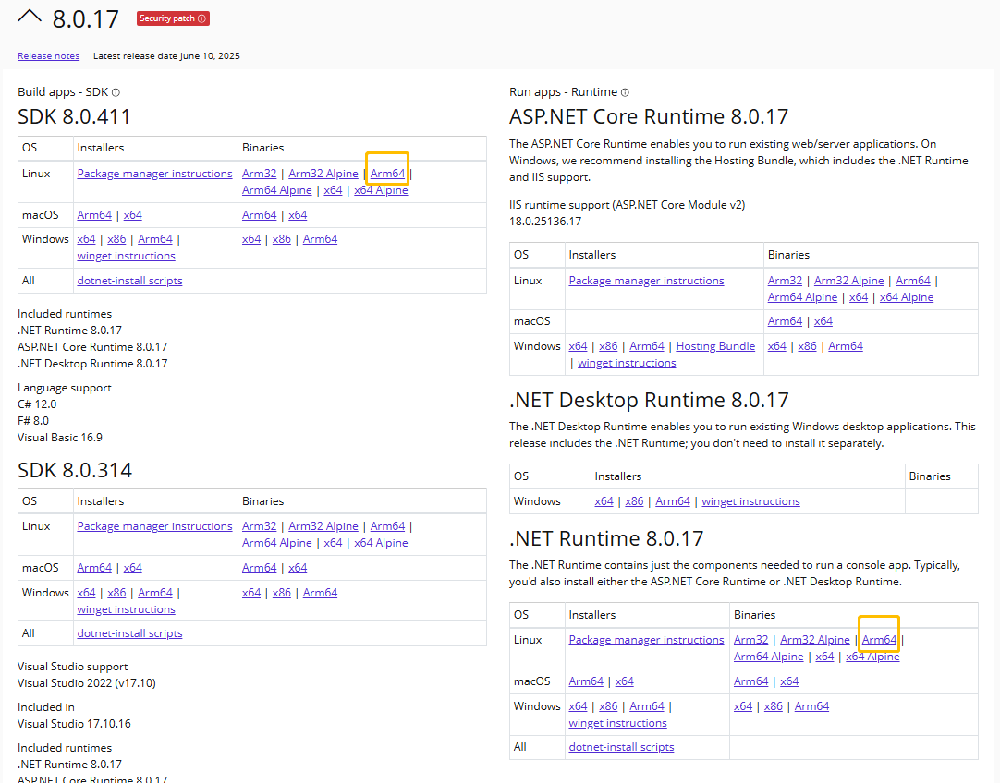

### Debix Runs .NET Application Example

🧩 **Step 1: Go to the official website to download the ARM64 version of .NET SDK and Runtime**  

🔗 Official website:  
👉 https://dotnet.microsoft.com/en-us/download/dotnet/8.0

Click:  
- **.NET SDK 8.x latest version (arm64 / Linux)**  
- If you only need to run applications, you can also download **.NET Runtime**  

  

📁 **Step 2: Copy the compressed package to DEBIX**  
Use SCP or a USB drive to transfer your downloaded file (e.g., `.tar.gz`) to DEBIX, for example:  
```shell
scp dotnet-sdk-8.0.411-linux-arm64.tar.gz debix@192.168.x.x:~
```  

📂 **Step 3: Create a directory and extract**  
```
mkdir -p $HOME/dotnet
tar -xzvf dotnet-sdk-8.0.411-linux-arm64.tar.gz -C $HOME/dotnet
```  
Enter the dotnet directory to check the version:  
```
root@DebixSomB:~/dotnet# ./dotnet --version
8.0.411
```  

✏️ **Step 4: Write the HelloWorld example**  
Create `HelloWorld.csproj`:  
```c
root@DebixSomB:~/dotnet# vim HelloWorld.csproj
<Project Sdk="Microsoft.NET.Sdk">

  <PropertyGroup>
    <OutputType>Exe</OutputType>
    <TargetFramework>net8.0</TargetFramework>
    <ImplicitUsings>enable</ImplicitUsings>
    <Nullable>enable</Nullable>
  </PropertyGroup>

</Project>
```  
Create `Program.cs`:  
```c
root@DebixSomB:~/dotnet# vim Program.cs
using System;

class Program
{
    static void Main(string[] args)
    {
        Console.WriteLine("Hello, DEBIX!");
    }
}
```  

🛠️ **Step 5: Compile the project**  
```shell
root@DebixSomB:~/dotnet# ./dotnet build

Welcome to .NET 8.0!
---------------------
SDK Version: 8.0.411

.....
......
  HelloWorld -> /root/dotnet/bin/Debug/net8.0/HelloWorld.dll

Build succeeded.
    0 Warning(s)
    0 Error(s)
```  

▶️ **Step 6: Run the program**  
```shell
root@DebixSomB:~/dotnet# ./dotnet run
Hello, DEBIX!
```