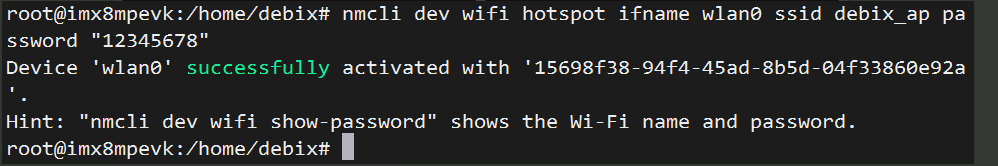
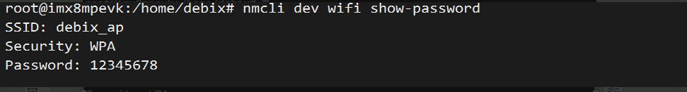
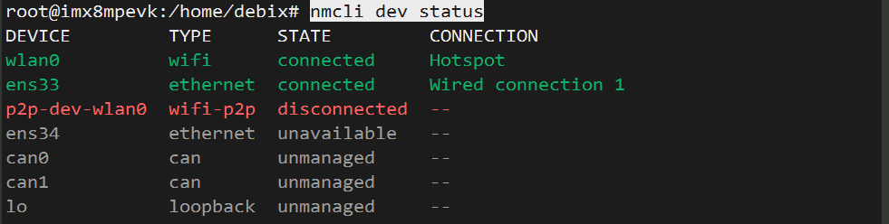
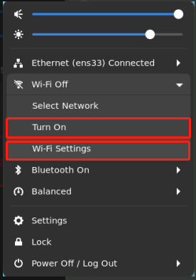
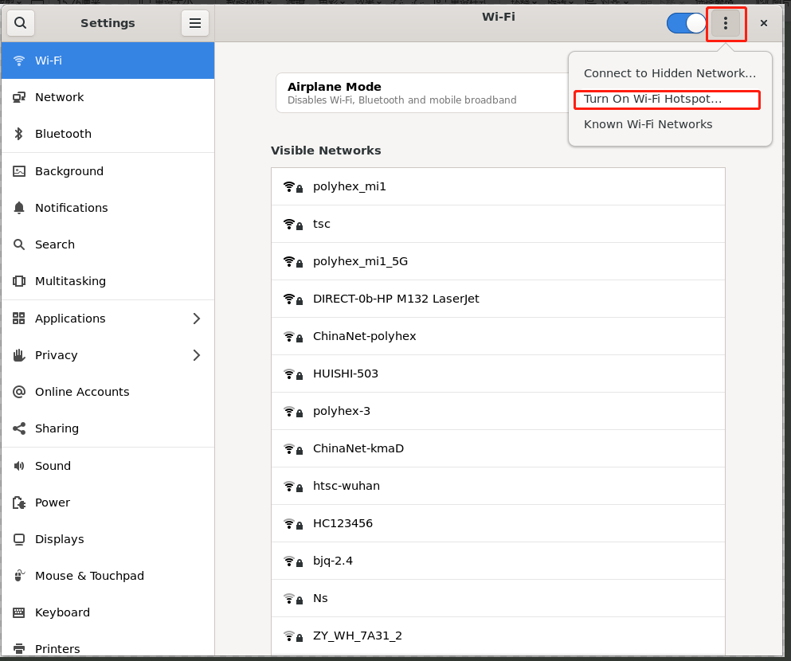
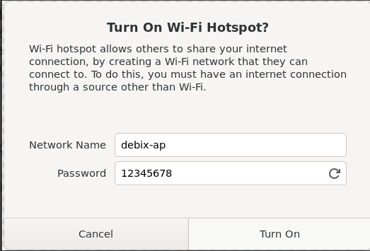

## 📶 Setting Up DEBIX as a Wi-Fi Hotspot (AP Mode)

### 🧾 Method 1: Command Line Operation (Recommended for Terminal Environment)

🧑‍💻 1. Switch to root user
```shell
sudo su
```

📡 2. Turn on Wi-Fi
```shell
nmcli radio wifi on
```

🛠️ 3. Create Wi-Fi hotspot
```shell
nmcli dev wifi hotspot ifname wlan0 ssid debix_ap password "12345678"
```

🔍 Parameter explanation:

| Parameter             | Meaning                          |
|-----------------------|----------------------------------|
| `ifname wlan0`       | Specify wireless interface name  |
| `ssid debix_ap`      | Set hotspot name (Wi-Fi SSID)    |
| `password "12345678"`| Set hotspot password (8-63 chars)|



✅ **After successful execution, DEBIX becomes a hotspot that other devices can connect to**

🔎 4. View hotspot name and password
```shell
nmcli dev wifi show-password
```



📊 5. Check network device status
```shell
nmcli dev status
```



### 🖼️ Method 2: Graphical Interface Operation (For Desktop Systems)

1️⃣ Open Wi-Fi settings interface  
Click the Wi-Fi icon in the system tray (top-right corner), then select:  
> **"Turn on"** to enable wireless  
> Then click **"Wi-Fi Settings"**  



2️⃣ Set hotspot information  
> 1. Click the "⁝" menu (three dots) in top-right corner  
> 2. Select **"Turn On Hotspot"**  



3️⃣ Customize hotspot name and password  
- Enter Wi-Fi name (SSID)  
- Set password (8+ characters)  
Click **"Turn On"** to create the hotspot.  

You can view current hotspot information at **"Wi-Fi Settings" → "Hotspot"**.  

