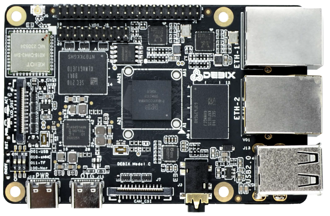
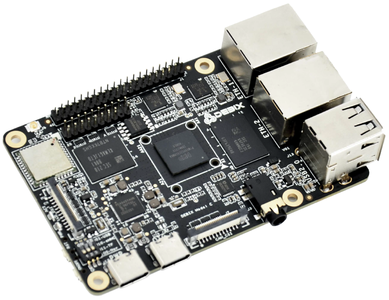
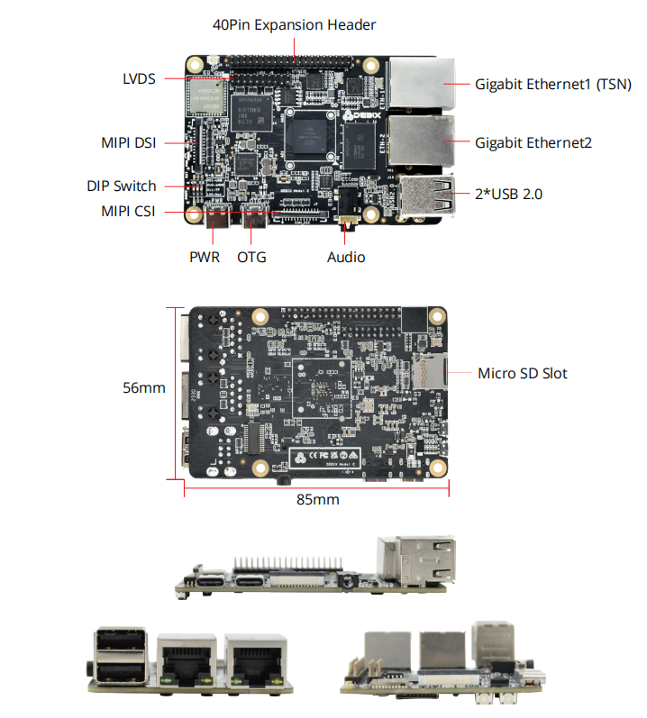

# DEBIX Model C i.MX 93 Single Board Computer
 

## Overview
DEBIX Model C is the first DEBIX single board computer to feature the NXP i.MX 93, a power-optimized processor rating up to 1.7GHz with only 1 watt of power at full load consumption, and the Arm Ethos™-U65 microNPU enables developers to create more capable ML applications. 

Engineered to deliver more energy-efficient and cost-effective solutions for intelligent edge computing, DEBIX Model C provides multiple extensible interfaces for IoT edge, contactless HMI, smart home, building control and industrial applications.

## Main Features
- NXP i.MX 93 processor: 1.7GHz, 1W (extended industrial grade, industrial grade and
consumer grade processors for options)
- Advanced security with integrated EdgeLock® secure enclave
- Ethos-U65 microNPU to bring MCU-class ML efficiency
- General-purpose Cortex-M33 up to 250MHz for real-time and low-power processing
- Supports system switching between Ubuntu 22.04 Server, Yocto-L6.1.36, Debian 12 Server
- Supports cooperative work on FreeRTOS and Linux dual systems

## Specification
| System          |                                                                         |
|-----------------|-------------------------------------------------------------------------|
| CPU             | NXP i.MX9352, 2 x Arm® Cortex®-A55 @1.7 GHz, 1 x Arm® Cortex®-M33 @250MHz, 1 x Arm® Ethos™-U65 microNPU @0.5TOPS. (i.MX 93 series CPU optional)|
| Memory          | 1GB LPDDR4 (2GB optional)                                               |
| Storage         | Default: Micro SD card (8GB/16GB/32GB/64GB/128GB/256GB optional) and onboard 8MB Nor Flash (Onboard 8GB/16GB/32GB/64GB/128GB/256GB eMMC optional)                         |
| OS              | Ubuntu 22.04 Server, Yocto-L6.1.36, Debian 12 Server (also supports OpenWRT and FreeRTOS) |
|**I/O Interface**|                                                                      
| Gigabit Ethernet| 1 x Gigabit Ethernet, supports TSN and POE power supply (need POE power device module) 1 x Gigabit Ethernet (POE power supply is not supported)                         |
| WiFi & BT       | 2.4GHz & 5GHz WIFI IEEE 802.11a/b/g/n, BT5.2                            |
| USB             | 2 x USB 2.0 Host, 1 x USB 2.0 OTG                                       |
| Audio           | 1 x Headphone and Mic combo port                                        |
| Slot            | 1 x Micro SD card slot                                                  |
|**Expansion**    |
| 40-Pin Dual-Row Header | (1) 1 x I2C, 2 x USB 2.0 Host, 4 x 12bit ADC in, 1 x UART for system debug; (2) 6 x GPIO for default, can be reused as PWM, UART, SPI, I2C and CAN through software configuration; (3) 5V power supply in/out, 1.8V/3.3V@300mA power out, system reset, ON/OFF. |
| LVDS            | 1 x 720p60 LVDS, single channel 8bit                                    |
| MIPI CSI        | 1 x 1080p60 MIPI CSI (2-lane)                                           |
| MIPI DSI        | 1 x 1080p60 MIPI DSI (4-lane)                                           |
| DIP Switch      | 1 x 3-bit DIP Switch                                                    |
|**Power Supply**|
| Power Supply    | DC 5V/2A via Type-C                                                     |
|**Mechanical & Environmental**|
| Size            | 85.0mm × 56.0mm (±0.5mm)                                                |
| Operating Temp. | -20°C to 70°C (-40℃ to 85℃ optional)                                  |
| Net Weight      | 43g (±0.5g)                                                             |

## Certificates:

## I/O Interfaces:

## Ordering Codes
| RAM LPDDR4  | eMMC Storage | PN for Model C -20℃~70℃ | PN for Model C -40℃~85℃ |
|-------------|--------------|--------------------------|---------------------------|
| **1GB DDR** | N/A | | Model C-I-D1E0 |
|       | 8GB   | Model C-D1E8    | Model C-I-D1E8 |
|       | 16GB  | Model C-D1E16   | Model C-I-D1E16 |
|       | 32GB  | Model C-D1E32   | Model C-I-D1E32 |
|       | 64GB  | Model C-D1E64   | Model C-I-D1E64 |
| **2GB DDR** | N/A | | Model C-I-D2E0 |
|       | 8GB   | Model C-D2E8    | Model C-I-D2E8 |
|       | 16GB  | Model C-D2E16   | Model C-I-D2E16 |
|       | 32GB  | Model C-D2E32   | Model C-I-D2E32 |
|       | 64GB  | Model C-D2E64   | Model C-I-D2E64 |

## Compatible with DEBIX's Accessories
| Product                     | Model               |
|-----------------------------|---------------------|
| DEBIX Fanless Aluminum Enclosure | EMC-7090B Model C|
| SBC POE Board              | EMB-AS-06          |
| DEBIX Camera Modules       | Camera 200A; Camera 500A |
| DEBIX Display Screens      | DEBIX TD050A; DEBIX TD070A; DEBIX TD101A |

## Safety Instructions and Warnings:
**General:**
- Avoid exposure to water, moisture and conductive surfaces while operating.
- Handle with care to avoid mechanical or electrical damage to the circuit board and connectors.
- Only handle the board by the edges when powered on to minimize the risk of electrostatic discharge damage.

**Power:**
- Use only a 5V/2A DC minimum external power supply that complies with relevant regulations and standards for your country.

**Environment:**
- Operate in a well-ventilated environment, even if using a case.
- Place on a stable, flat, non-conductive surface and avoid contact with conductive items.

**Connections:**
- Only connect compatible devices to the GPIO ports to avoid damage and warranty
voiding.
- Use peripherals that comply with relevant standards for the country of use and ensure proper insulation and operation.

**Additional notes:**
- This summary is not exhaustive, please refer to the full User Manual for details.
- If you are unsure about any aspect of safety or operation, consult a qualified
professional.

## Contact Us
- **Headquarters**: DEBIX Technology Inc., 8345 Gold River Ct., Las Vegas, NV 89113, USA  
- **Factory**: 5-6/F., East Zone, Shunheda A2 Building, Liqxiandong Industrial Park, XiLi, Nanshan Dist., Shenzhen, China  
- **Email**: info@debix.io  
- **Website**: [www.debix.io](https://www.debix.io)  
- **Community**: [Discord](https://discord.com/invite/adaHHaDkH2)