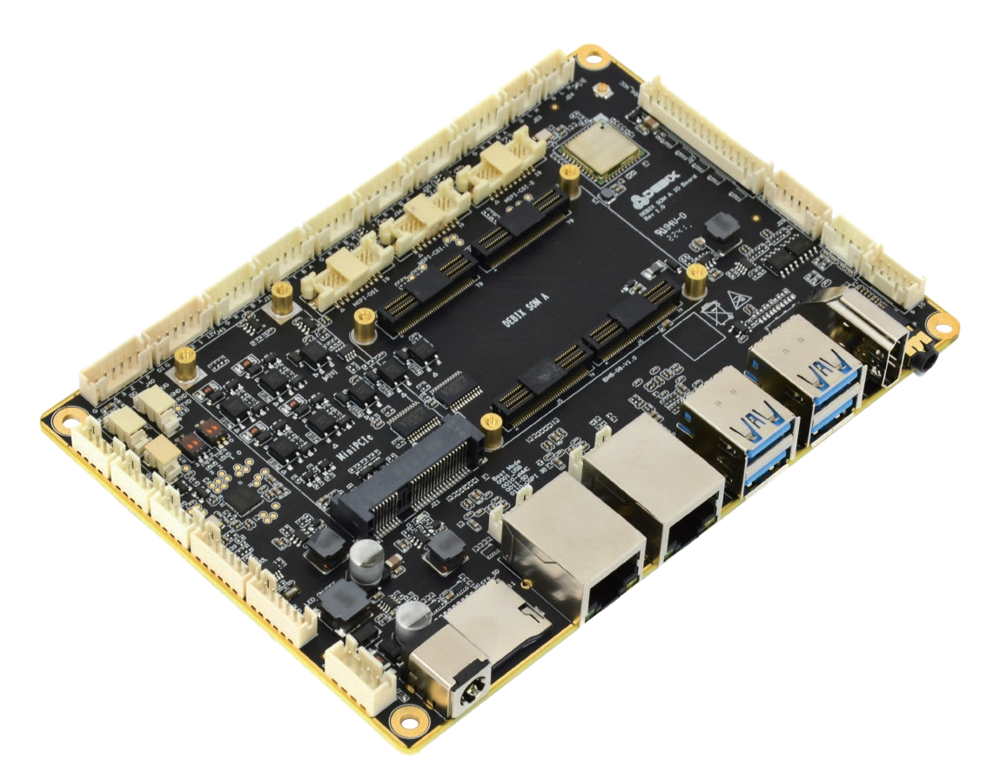
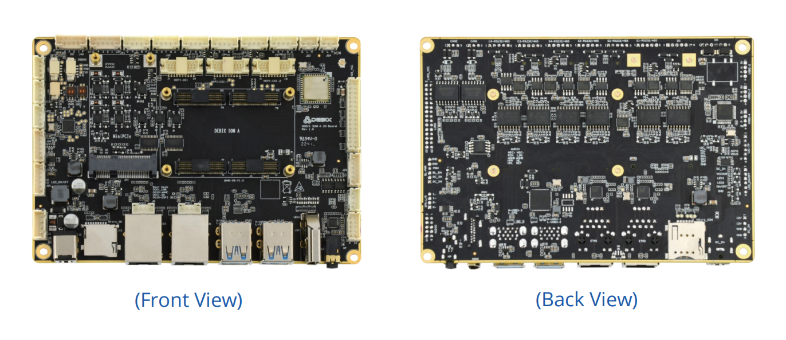
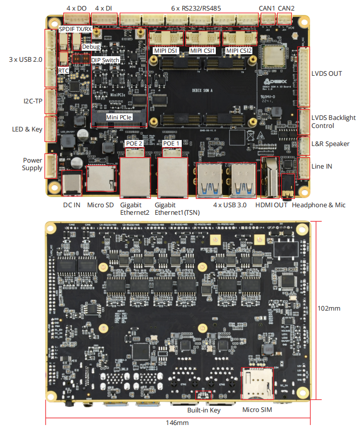
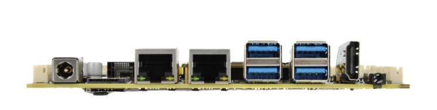
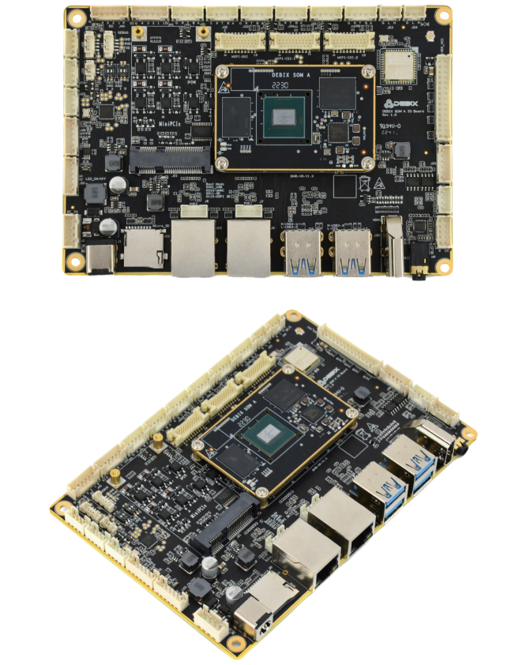

# DEBIX SOM A IO Board
 

## Overview
DEBIX SOM A I/O Board is a carrier board designed for DEBIX SOM A, which connects to 
DEBIX SOM A through 4 double-sided board-to-board socket connectors on its front side. 
It's all about full-featured interfaces supported by the core board based on i.MX 8M Plus, 
and provides a perfect solution combining the functions required for industrial control, 
IoT connection and multimedia.

## Main Features
- **Feature-rich interfaces** to take advantage of the i.MX 8M Plus processor to the
fullest extent
- **Flexible boot options:** Besides boot from eMMC on DEBIX SOM A, the I/O Board
supports boot from Micro SD and SPI Nor Flash
- **Industrial-grade isolation:** The serial ports, CAN and GPIO of the I/O Board are
designed with isolation, dedicated to industrial and IoT applications
- **Powerful Connectivity:** Support dual Gigabit Ethernet with POE function, 2.4GHz &
5GHz Wi-Fi and Bluetooth 5.0

## Specification
|   System               |             |
|------------------------|-------------|
| Core Board    | DEBIX SOM A |
| Boot          | (1) Support boot from eMMC on DEBIX SOM A (2) Support boot from Micro SD on carrier board (3) Support boot from SPI Nor Flash on carrier board (reserved) |
| **Video & Audio**      |             |
| HDMI   | 1 x HDMI output |
| LVDS   | (1) 1 x Dual-channel LVDS output, support single-channel 8bit and dual-channel 8bit output (2) 1 x Backlight control connector (3) 1 x I2C touch panel connector |
| MIPI DSI | 1 x 4-lane MIPI DSI |
| MIPI CSI | 2 x 4-lane MIPI CSI |
| Audio  | (1) 1 x 3.5mm Headphone and mic combo port, compatible with built-in header design (2) 1 x Line in, analog input (3) 1 x L&R speaker output, Max. 3W@4Ω (4) 1 x SPDIF TX/RX audio connector |
| **Communication**      |             |
| Gigabit Ethernet | 2 x Independent MAC Gigabit Ethernet port with POE power supply (need POE power device module) (One of them supports TSN.) |
| WFI & BT | 2.4GHz & 5GHz Wi-Fi and Bluetooth 5.0, external SMA antenna connectors for Wi-Fi and 4G |
| **Other I/O Interfaces** |             |
| SIM Slot | 1 x Micro SIM slot, push pop-up slot |
| SD Slot | 1 x Micro SD slot, push pop-up slot |
| Mini PCIe | (1) Support 4G Mini PCIe module such as Quectel 4G Module, built-in SIM card, etc. (2) Support LoRa Mini PCIe module (3) Support Mini PCIe expansion for network card, SATA and serial port |
| USB 3.0 | 4 x USB 3.0 Host |
| USB 2.0 | 3 x USB 2.0 Host |
| Serial Ports | (1) 6 x Isolated RS232/RS485 (you can choose only one of two), compatible with UART TTL 3.3V without Isolation (2) 1 x UART TTL 3.3V system debug port |
| GPIO | (1) 4 x Isolated DI, support dry contact and wet contact (2) 4 x Isolated DO, support wet contact, compatible with dry contact of external relay |
| CAN | 2 x Isolated CAN |
| LED & key | (1) 1 x Power LED (2) 2 x Programmable LED (3) 1 x ON/OFF The above interfaces share one connector (4) Built-in small key for eMMC upgrade without disassembly |
| DC Jack | (1) 1 x DC jack for 5.5mm x 2.1mm DC plug (2) 1 x Built-in power supply connector |
| **Power Supply**       |             |
| Power Input | DC 12V/2A for default, support wide voltage range of DC 12V~36V |
| **Mechanical**         |             |
| Size      | 146.0mm x 102.0mm (±0.5mm) |
| Operating Temp. | -20°C~70°C for default, -40°C~85°C optional |
| Net Weight | 127g(±0.5g) |
| Gross Weight | 206g(40.5g)(Neutral packaging) |

## I/O Interfaces:

## Connection with DEBIX SOM A:

## Safety Instructions and Warnings:
**General:**
- Avoid exposure to water, moisture and conductive surfaces while operating.
- Handle with care to avoid mechanical or electrical damage to the circuit board and connectors.
- Only handle the board by the edges when powered on to minimize the risk of electrostatic discharge damage.

**Power:**
- Only use the product with a DEBIX SOM A and a 12V/2A DC external power supply that complies with relevant regulations and standards for your country.

**Environment:**
- Operate in a well-ventilated environment, even if using a case.
- Place on a stable, flat, non-conductive surface and avoid contact with conductive items.

**Connections:**
- Only connect compatible devices to the GPIO ports to avoid damage and warranty
voiding.
- Use peripherals that comply with relevant standards for the country of use and ensure proper insulation and operation.

**Additional notes:**
- This summary is not exhaustive, please refer to the full User Manual for details.
- If you are unsure about any aspect of safety or operation, consult a qualified
professional.

## Contact Us
- **Headquarters**: DEBIX Technology Inc., 8345 Gold River Ct., Las Vegas, NV 89113, USA  
- **Factory**: 5-6/F., East Zone, Shunheda A2 Building, Liqxiandong Industrial Park, XiLi, Nanshan Dist., Shenzhen, China  
- **Email**: info@debix.io  
- **Website**: [www.debix.io](https://www.debix.io)  
- **Community**: [Discord](https://discord.com/invite/adaHHaDkH2)